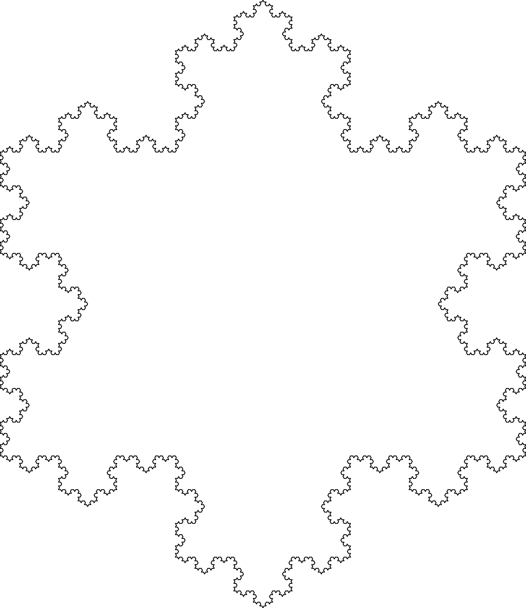
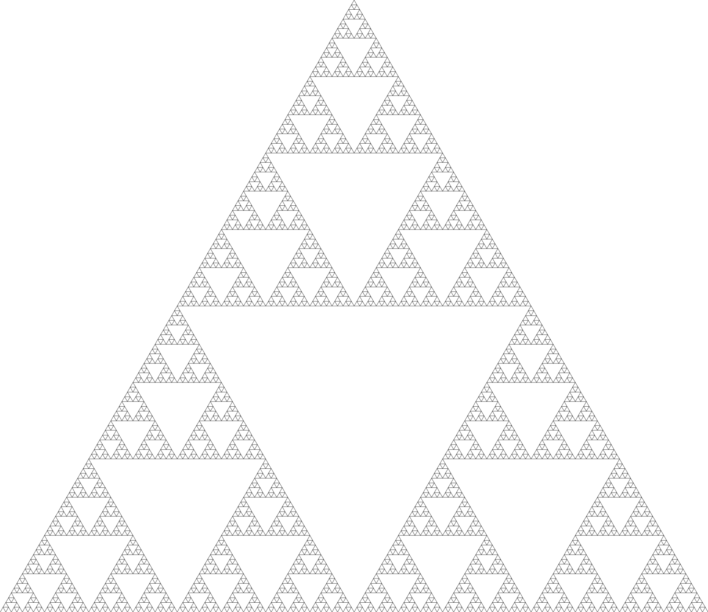

<!------------------------------------------------- README ---------------
    |
    |   Developers:  
    |       Carlos García - https://github.com/cxrlos
    |       Yann Le Lorier - https://github.com/yannlelorier
    |
    *-------------------------------------------------------------------->

# Fractal image generation in Racket 

## 1. Authors

[Carlos García](https://github.com/cxrlos)\
[Yann Le Lorier](https://github.com/yannlelorier)

## 2. Context

Fractals are as beautiful to see as they are helpful in different scenarios. They are a relevant case study in the field of mathematics, as they are able to represent complex landscapes such as mountain ranges, or even create a visualization of the spread of bacteria.

## 3. Project Description

The project's objective is to study how fractals are constructed, due to its recursive nature.

### 3. 1 Sierpinski triangles

First described in 1915 by Waclaw Sierpinski, these geometrical figures are fractals generated by triangles. They are formed by the union of the line segments of equally-sized triangles; these generate larger triangles which can be connected to other line segment of an equally-sized triangle.\
Although it's common belief that its beauty is the only application, some people have found it useful for purposes regarding a specific field of study such as [musical composition](https://aquila.usm.edu/cgi/viewcontent.cgi?article=1366&context=honors_theses) and [Hanoi puzzle modeling](http://www.math.ubc.ca/~cass/courses/m308-02b/projects/touhey/). 

### 3. 2 Koch fractals

Helge von Koch first depicted this fractal curve in 1904. The generation process consists of an equilateral triangle which suffers a modification in the inner third of each side that generates a smaller equilateral triangle. This process is then repeated on the newly-generated figures until an arbitrary number of repetitions is reached.\
Koch fractals are commonly related to nature-inspired figures such as snowflakes (known as the [Koch Snowflake](http://www.math.ubc.ca/~cass/courses/m308/projects/fung/page.html)) but also have mathematical applications; for instance, there has been plenty of research on Koch fractal applications regarding topological neighborhood problems such as [Complex Dimensions](https://www.researchgate.net/publication/239609840_A_Tube_Formula_for_the_Koch_Snowflake_Curve_with_Applications_to_Complex_Dimensions).

## 4. Topics

1. **File IO**
    - To make various processing requests for many figures
2. **Functional Programming**
   - Due to the figures that we want to draw, functional programming makes sense as a solution to the problem
3. **Recursion**
    - Because of the recursive nature of fractal figures and other types of figures, functional programming is an option that makes sense

## 5. Use Cases

The program serves as a study to analyze behavior of fractals construction, and to deepen knowledge on recursion and its applications.

## 6. Dependencies

- Racket
- 2htdp package

## 7. Running the program

Clone or download the repository. Read the [Instructions.txt](https://github.com/cxrlos/Numerical-Methods-Solver/blob/master/Instructions.txt) file to modify the [Configurations.txt](https://github.com/cxrlos/Numerical-Methods-Solver/blob/master/Configuration.txt) file.\
After the desired values are set, simply open DrRacket, open the [Main.rkt](https://github.com/cxrlos/Numerical-Methods-Solver/blob/master/Main.rkt) script and click on the "Run" button at the top. The output images should be displayed in the same directory as the scripts.
